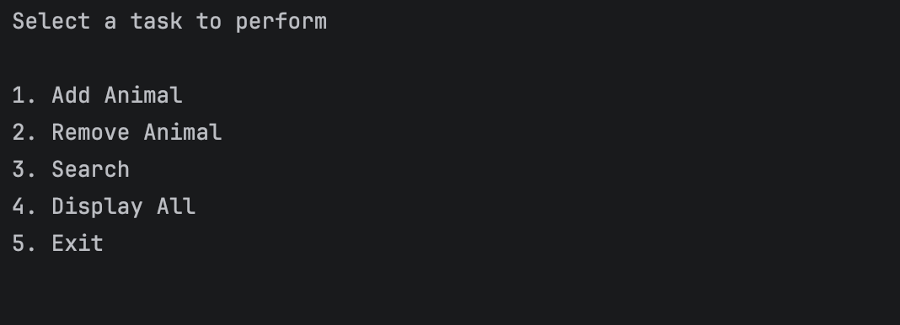
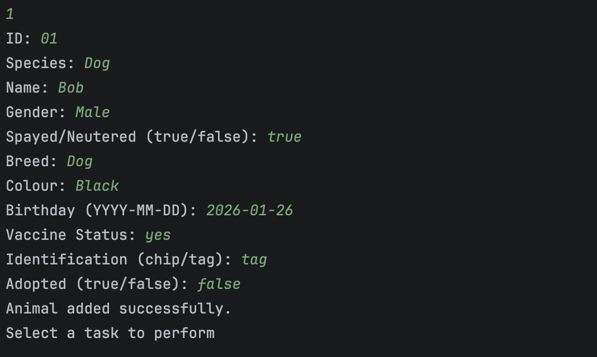
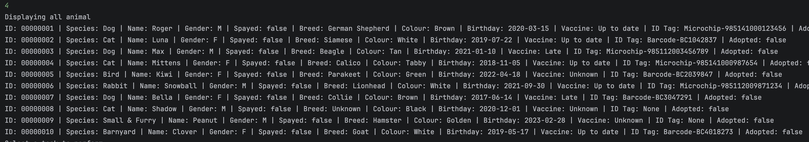

# Animal Rescue CLI 🐾

A Java-based CLI application to manage animals in a shelter.

## Features
- Add / Remove animals
- Search by name or species
- Sort animals
- Archive adopted animals
- Adoption fee calculation

## How to Run

– Using Maven
```bash
mvn clean package
java -jar target/animal-rescue-jar-with-dependencies.jar
```

– Using Docker
```bash
docker build -t animal-rescue-jar-with-dependencies .
docker run -it animal-rescue-jar-with-dependencies
```

– Using a Shell Script
```bash
 bash run.sh
```


## Project Structure
```
├── Dockerfile
├── README.md
├── data
│   └── animals.csv
├── pom.xml
├── run.sh
├── screenshots
│   ├── add_animal.png
│   ├── display_all.png
│   └── initial.png
└── src
    ├── main
    │   ├── java
    │   │   └── com
    │   │       └── churchill
    │   │           ├── Main.java
    │   │           ├── model
    │   │           │   └── Animal.java
    │   │           └── util
    │   │               └── FileHandler.java
    │   └── resources
    └── test
        └── java
```
### Menu


### Add Animal


### Display All
